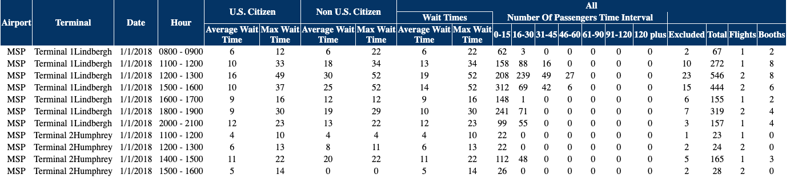

This R Markdown document includes contributions from Professor Jessi Kehe.

### Setup details

- You will need the packages `tidyverse`, `lubridate`, and `XML` for these lectures.
    - Make sure to install them if you haven't already.  

- This assumes you have the R script `viridis.R` two steps back from the working directory (`"../../scripts/viridis.R"`).
    - Be sure to adjust the code if you have this script in a different location.

- The following data files will be used and are assumed to be located two steps back from the working directory in a folder called `data/`.
    - `"../../data/DEN-2018.html"`  
    - `"../../data/JFK-2018.html"`  
    - `"../../data/LAX-2018.html"`  
    - `"../../data/MSP-2018.html"`  
    - `"../../data/ORD-2018.html"`  
    - `"../../data/SFO-2018.html"`  

```{r setup, include=FALSE}
knitr::opts_chunk$set(echo=TRUE, message=FALSE, warning=FALSE,
                      cache=TRUE, autodep=TRUE, cache.comments=FALSE)
library(tidyverse)
library(scales)
library(lubridate)
library(XML) #For reading in HTML files
## Note: this code assumes viridis.R is two steps up the file directory tree in a `scripts` folder
source("../../scripts/viridis.R")
```

## Importing the data files

## Airport Waiting Times

### Overview
- In the US, Customs and Border Patrol gathers statistics on the number of flights and passengers that go through customs at many US airports on an hourly basis.

- They also gather statistics on waiting times.
  - mean and maximum time  
  - number of booths open  
  - separate for domestic and international travelers  
  
###  Airports
- We will look at data from 2018 on several US Airports
  - DEN (Denver) 
  - JFK (New York)  
  - LAX (Los Angeles)  
  - MSP (Minneapolis and St. Paul)
  - ORD (Chicago, O'Hare)  
  - SFO (San Francisco)  
  
### R commands
- XML package  
  - `readHTMLTable()`
  
- dplyr package:  
  - `bind_rows()`
  - `across()`
  - `where()`
  
- lubridate package:  
  - `mdy()`

## Data Format

- The data files available by download are in HTML format
    - The government website distributing the data claims they are CSV files and your browser will label them as such, but they are not.
- Hence, we cannot use our trusty `read_csv()` command to read in the data.
- Instead, we will use a function from a package outside of the **tidyverse** to read in data from HTML.

## Reading in an HTML Table

- The function `readHTMLTable()` in the `XML` package can read in tables from HTML files.
- However, it expects tables to have a single header row.
- When they do not, such as in this example, it takes more care and several steps.
- The function code below does a number of things to read in the data.
    - Grab part of a list as the data
    - Use `slice()` to get rid of the three header lines
    - Add new column names
    - All variables will be character valued. Change this using:
        - `mutate()` with `across()` to select many variables to apply a function to
    - Use `mutate()` from `dplyr` and `mdy()` from `lubridate` to modify the date variable.
    
### Consider MSP for our test airport file 

- Eventually, we want to read in data from multiple airports and combine these into a single large data file.
- Before doing this, we will work out how to read in a single file and then write a function we can apply to them all.
- We will use data from all international arrivals in 2018 at the Minneapolis-St. Paul airport, MSP, as a test case.

```{r read-airport-html-1}
### Let's look at the actual HTML file first, then try to read in the data
test_airport_file = "../../data/MSP-2018.html" # specify airport file
```

- When opened with a browser, the beginning of this file appears like this.



- Notice that the information about the variables is in the first three lines of information, and not just in a single row.
- In addition, some of the header rows spread information over several columns.
- These complications defeat reading in the data with a simple single call to a function

- The file is an HTML file, which is a plain text file in a specific markup language, and looks like this in its raw format.

```
<div id="resultsContainer95"><style>table thead tr th {background-color: #003366;color: white;}table, th, td {border: 1px solid white;}table {border-collapse: collapse;}</style><table style="width: 100%;" summary="This table contains the results of wait times for passengers for a given time frame based on airport/terminal"><thead><tr><th colspan="1" rowspan="3">Airport</th><th colspan="1" rowspan="3">Terminal</th><th colspan="1" rowspan="3">Date</th><th colspan="1" rowspan="3">Hour</th><th colspan="2" rowspan="2">U.S. Citizen</th><th colspan="2" rowspan="2">Non U.S. Citizen</th><th colspan="13" style="border: none;">All</th></tr><tr><th colspan="2" style="">Wait Times</th><th colspan="7" style="border-top: none;">Number Of Passengers Time Interval</th><th colspan="4" style="border-top: none;"></th></tr><tr><th>Average Wait<br>Time </th><th>Max Wait<br>Time</th><th>Average Wait<br>Time</th><th>Max Wait<br>Time</th><th>Average Wait<br>Time</th><th>Max Wait<br>Time</th><th>0-15</th><th>16-30</th><th>31-45</th><th>46-60 </th><th>61-90 </th><th>91-120 </th><th>120 plus </th><th>Excluded </th><th>Total </th><th>Flights </th><th>Booths </th></tr></thead><tr class="even"><td style="text-align: center" headers="airport">MSP</td><td style="text-align: center" headers="terminal">Terminal 1Lindbergh</td><td style="text-align: center" headers="Date">1/1/2018</td><td style="text-align: center" headers="hour">0800 - 0900</td><td style="text-align: center" headers="airport">6</td><td style="text-align: center" headers="terminal">12</td><td style="text-align: center" headers="Date">6</td><td style="text-align: center" headers="hour">22</td><td style="text-align: center" headers="WaitTime avg">6</td><td style="text-align: center" headers="WaitTime max">22</td><td style="text-align: center" headers="NumberPassengers 0-15">62</td><td style="text-align: center" headers="NumberPassengers 16-30">3</td><td style="text-align: center" headers="NumberPassengers 31-45">0</td><td style="text-align: center" headers="NumberPassengers 46-60">0</td><td style="text-align: center" headers="NumberPassengers 61-90">0</td><td style="text-align: center" headers="NumberPassengers 91-120">0</td><td style="text-align: center" headers="NumberPassengers 121Plus">0</td><td style="text-align: center" headers="Excluded">2</td><td style="text-align: center" headers="Total">67</td><td style="text-align: center" headers="Flights">1</td><td style="text-align: center" headers="Booths">2</td></tr><tr class="odd">
```

- You can see the difference between a "mark up" language like HTML and a "mark down" language like we use in our .Rmd files.
    - The former is readable by a person, but you would never want to write a file like this by typing.

#### Specify the column names that we want to use

- As we will delete the lines of the file with the variable names, let's create the names we want to use.
- As this is a one-time effort, there is not much benefit in thinking about how to write code to extract a single row of variable names from the three rows in the HTML file.

```{r read-airport-html-2}
# Next we specify the column names
airport_column_names = c("airport",
                           "terminal",
                           "date",
                           "hour",
                           "us_avg_wait",
                           "us_max_wait",
                           "non_us_avg_wait",
                           "non_us_max_wait",
                           "all_avg_wait",
                           "all_max_wait",
                           "all_n_0_15",
                           "all_n_16_30",
                           "all_n_31_45",
                           "all_n_46_60",
                           "all_n_61_90",
                           "all_n_91_120",
                           "all_n_120_plus",
                           "all_excluded",
                           "all_total",
                           "all_flights",
                           "all_booths")
airport_column_names
```

#### Read in the data using readHTMLTable()

- This next chunk of code:
    - reads in the HTML
    - grabs the data as a data frame
        - (but treats the second and third header rows as actual data, resulting in all variables being classified as character valued)
    - slices away the first three rows with the header information
    - renames the default variable names with the new ones we selected
        
```{r read-airport-html-3}
test_airport = readHTMLTable(test_airport_file)$`NULL` %>% 
    slice(-(1:3)) # Remove the first three rows 

names(test_airport) # default column names
names(test_airport) = airport_column_names # replace with new names
names(test_airport)
```

#### Make a Tibble and adjust structure

- The data we have read in is a base R data frame and not a tibble
- All columns are treated as character-valued, even though most are numerical
- Character columns in base R data frames are treated as factors, and we just want them to be plain character variables
- We want to change all of these to accurately represent the data

```{r read-airport-html-4}
## class
class(test_airport)

# Look at the data types for the different variables
str(test_airport)
```

- We need to:
    - Change the variables that ought to be numeric to have numeric format
    - Change factors back into character vectors
    - Change the date into date format
- We could do this one variable at a time using tools we already have:

```{r, eval = FALSE}
test_airport = test_airport %>% 
  mutate(airport = as.character(airport),
         terminal = as.character(terminal),
         date = mdy(date),
         us_avg_wait = as.numeric(us_avg_wait))

## and so on, listing each column to modify one-by-one
```

- But there is a better way.

- Here we will learn about a new function `across()` which we use to apply a function to a selection of columns in a data set
    - `across()` is more general than and meant to replace functions such as `mutate_at()` and `mutate_if()`
    - `across()` was created after the *R4DS* book was written, so we need other sources to describe how it works
    - What follows is a very brief description
    
#### across() and where()

- The basic idea of `across()` is to:
    - select a number of columns with the first argument
    - provide a function (or more than one) as the second argument
    - apply the function(s) to each selected column
- In the simplest case using `across()` within `mutate()`, the columns are replaced by their new values and retain the same names
- We can also use `across()` within `summarize()` when we want to create a summary by applying the same function to a selection of columns without needing to list them each individually

- The first argument of `across()` handles all the usual **tidyverse** ways to select columns:
    - a collection of names inside of `c()`, such as `c("us_avg_wait","us_max_wait")`
    - a numerical sequence, such as `5:6`
    - helper functions, such as `begins_with("us")`
- You may use the standard vector operations `|` and `&` to combine conditions or `!` to negate something
- The second argument is the name of the function, without the `()` after.
    - We are passing the function itself, and not the return value of the function
- The helper function `where()` is used inside of `across()` when we want to use base R functions that return TRUE or FALSE where we would otherwise use **tidyverse** functions.
- For example, the function `is.factor()` could be applied separately to each column of the data frame, returning TRUE or FALSE.
    - But there is no **tidyverse** select helper function named `is_factor()` which selects all columns that are factors.
    - Instead, we use `where(is.factor)` which selects all columns where `is.factor()` applied to the column is true.
    - This is a more elegant solution than creating separate tidy select functions for many different possibilities

```{r read-airport-html-5}
test_airport = test_airport %>%
## convert to a tibble
  as_tibble() %>%
## select columns that ought to be numeric and convert them  
  mutate(across(ends_with("wait") | starts_with("all"), as.numeric)) %>% 
## select all factors and make them character variables  
  mutate(across(where(is.factor), as.character)) %>%
## change date to date format  
  mutate(date = mdy(date))

str(test_airport)

test_airport
```

### Define function for reading in other files

- We want to do the same steps as with our test airport for several different data files. - To make the code cleaner, let's define a function `read_airport()` that takes an HTML and carries out the same steps as above.

```{r stuff-for-all-airports}
## Input:  x = HTML file
## Output: nicely formatted tibble
read_airport =  function(x)
{
  airport_column_names = c("airport",
                           "terminal",
                           "date",
                           "hour",
                           "us_avg_wait",
                           "us_max_wait",
                           "non_us_avg_wait",
                           "non_us_max_wait",
                           "all_avg_wait",
                           "all_max_wait",
                           "all_n_0_15",
                           "all_n_16_30",
                           "all_n_31_45",
                           "all_n_46_60",
                           "all_n_61_90",
                           "all_n_91_120",
                           "all_n_120_plus",
                           "all_excluded",
                           "all_total",
                           "all_flights",
                           "all_booths")

  airport = readHTMLTable(x)$`NULL` %>%
    slice(-(1:3))

  names(airport) = airport_column_names

  airport = airport %>%
    as_tibble() %>%
    mutate(across(ends_with("wait") | starts_with("all"), as.numeric)) %>% 
    mutate(across(where(is.factor),as.character)) %>% 
    mutate(date = mdy(date))
  
  return( airport )
}
```

## Read the Data

- We can now read in the data from six different airports.
- Note that each function call is reading in a large HTML file and converting this to data.
    - This is much more complex than reading in a plain csv file
    - All of the HTML markup code needs to be eliminated
    - The result is that reading in the data from HTML is much slower
    - Expect this chunk to take some time to execute

```{r read-data}
den = read_airport("../../data/DEN-2018.html")
jfk = read_airport("../../data/JFK-2018.html")
lax = read_airport("../../data/LAX-2018.html")
msp = read_airport("../../data/MSP-2018.html")
ord = read_airport("../../data/ORD-2018.html")
sfo = read_airport("../../data/SFO-2018.html")
```

## Combine the data into one large data frame

- Next, use `bind_rows()` to paste these together into a single large data frame
    - This only works if the columns all match up
- Then, remove the individual data sets

```{r combine-data}
## combine
awt = bind_rows(den, jfk, lax, msp, ord, sfo)

## remove the individual ones
rm(den, jfk, lax, msp, ord, sfo)

str(awt)
```

